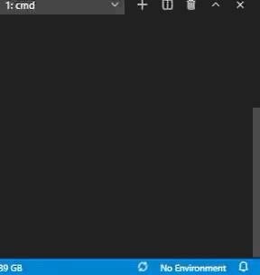
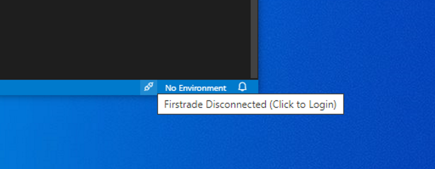
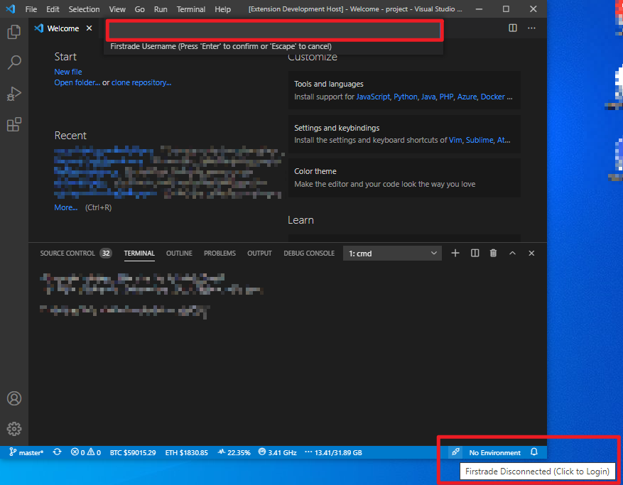

# Extension for Visual Studio Code - Firstrade Monitor

Simple live Firstrade Balance in your status bar.



## Features

Extension for Visual Studio Code - Allows you to keep track of your Firstrade Balance.





## Settings

One can set the scrollSpeed to schedule the updated by using :

```
"firstrade-monitor.scrollSpeed" : 60
```

One can change the display location by using :

```
"firstrade-monitor.alignment" : "Right"            // Default "Left"
```

## Release Notes

## 0.3.1

bugs fixed

### 0.3.0

Initial release

---

**Enjoy!**

> DISCLAIMER: We disclaim any and all responsibility for losses incurred through the use of this information.
